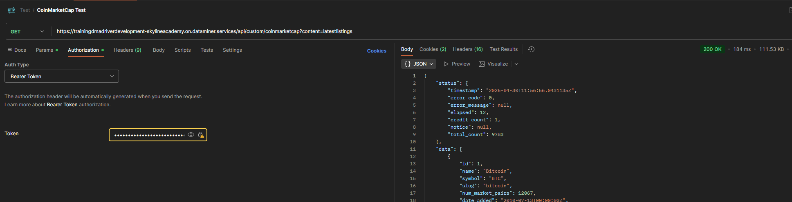

# Training Exercise HTTP CoinMarketCap

## Description

The goal of this exercise is to implement the [CoinMarketCap API](https://coinmarketcap.com/api/documentation/pro-api-reference/cryptocurrency#cryptocurrency-listings).

* Please implement the following endpoints/call (only implement the useful columns, free to choose).
  * GET /api/custom/coinmarketcap?content=latestlistings
  * GET /api/custom/coinmarketcap?content=categories
    * Refresh button on row level for an individual category.
    * /api/custom/coinmarketcap?content=category&id={CategoryId}
  * GET /api/custom/coinmarketcap?content=latestquotes

> [!NOTE]
> Note that we made the data available as a simulation internally, don't query the pro-coinmarketcap directly but use these details instead:
> - HTTP(S) Endpoint:
>   - https://trainingdmadriverdevelopment-skylineacademy.on.dataminer.services
> - Authentication:
>	  - The Bearer token to use is available in the Skyline Communications organization section on https://passwords.skyline.be/.  
>     Copy the token for 'Training Exercise HTTP CoinMarketCap API'.

## Pointers

Handle this exercise as would be for a customer.

* All parameter names/descriptions should be carefully chosen to really reflect the value.
* No errors/major/minor/... should be reported by the DIS validator.
* No magic numbers in QActions.
* Alarming and trending where needed.
* Some rules when working with tables:
  * Every column name should start with the table name.
  * Every column description has the table description between round brackets.
* Think about Unit Test(s) where applicable.

## Tips

* To parse the JSON use NewtonSoft.Json.
* Consider using the QActionTableRows for updating tables.
* You can test the API call with Postman before implementing.

